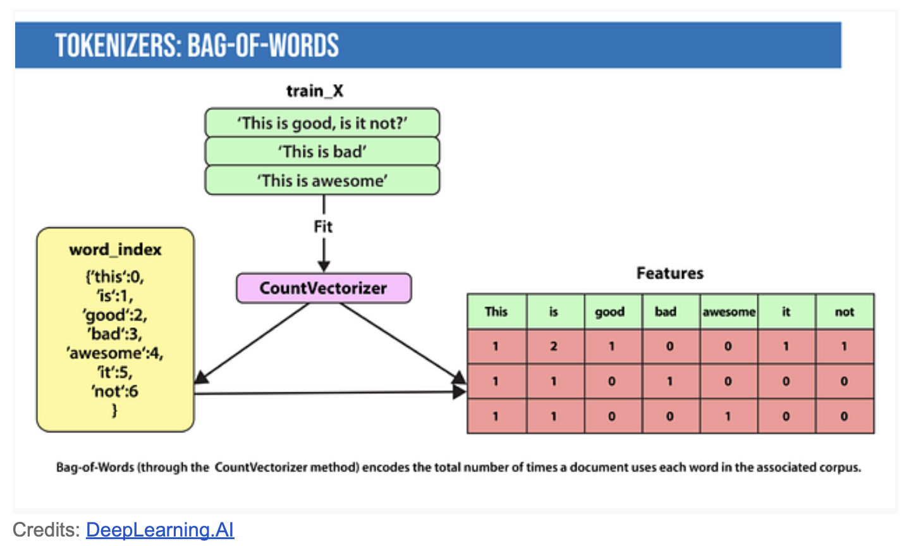
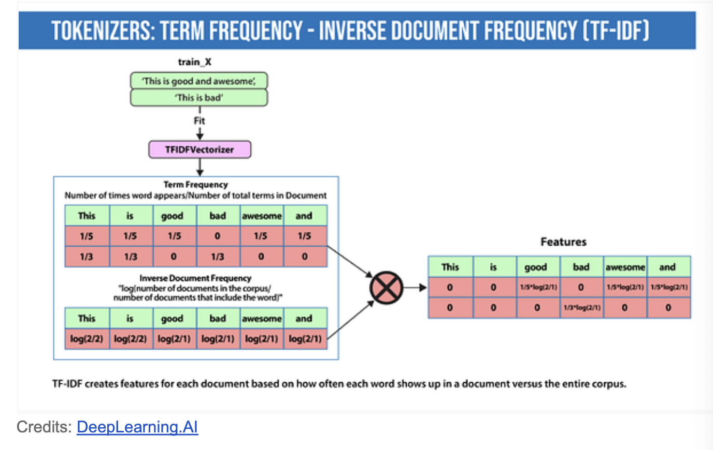
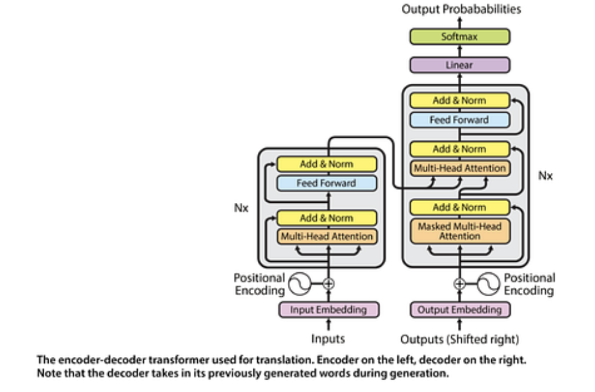

# Intro to NLP

- Feature engineering/Preprocessing
- Modeling
- what is the output
- used for classification?

### **1. Forms of preprocessing:**
- Normalization:
    - Lowercasting
    - Remove Punctuation
    - Removing Stop Words (like and, the, is)
- Tokenization: The process of breaking down text into smaller units called tokens, which can be words, subwords, or characters.
- Stemming: 
    - Definition: The process of reducing words to their root form by stripping suffixes and prefixes.
    - Example: The words “running” and “runner” are stemmed to “run”.
    - Stemming is a more crude technique compared to lemmatization and may not always produce real words.
- Lemmatisation:
    - Definition: The process of reducing a word to its base or dictionary form, called a lemma.
    Example: The words “running” and “ran” are lemmatized to “run”.
    Stemmers are faster and computationally less expensive than lemmatizers.

from nltk.stem import WordNetLemmatizer
lemmatizer = WordNetLemmatizer()
print(lemmatizer.lemmatize("Communication", 'v'))

### **2. Feature Extraction**
Machine-learning techniques work on the features generally in numbers that describe a document in relation to the corpus that contains it.
There are different forms.

**Bag of words**

**Term Frequency-Inverse Document Frequency**
Definition: TF-IDF (Term Frequency-Inverse Document Frequency) is a numerical statistic used to evaluate the importance of a word in a document relative to a collection of documents (or corpus)
Combining it helps to find important words.

**N-grams**
Definition: Contiguous sequences of n items (typically words or characters) from a given text or speech. Captures context and word dependencies in text.

**Word Embeddings**
Definition: Word embeddings are dense vector representations of words that capture their meanings, syntactic properties, and relationships with other words. Unlike traditional methods like Bag of Words or TF-IDF, which treat words as discrete entities, word embeddings map words into a continuous vector space where semantically similar words are located near each other.

**Contextual word embeddings**
Definition: Contextual word embeddings capture the meaning of a word based on its context in a sentence. Unlike traditional word embeddings (like Word2Vec), which provide a single vector for each word regardless of context, contextual embeddings produce different vectors for a word depending on the surrounding words.
Examples: ELMo, BERT, GPT

### **3. Modeling**
After data is preprocessed, it is fed into an NLP architecture.

- For classification: Output of TF-IDF vectorizer could be provided to logistic regression, naive Bayes, decision trees, or gradient boosted trees
- Deep neural networks typically work without using extracted features, although we can still use TF-IDF or Bag-of-Words features as an input
- Language Models: Predict next word when given a stream of input words. Pre-trained language models learn the structure of a particular language by processing a large corpus. They can then be fine-tuned for particular task. 

#### **Language Model**
Definition: A language model is a type of statistical model that predicts the next word in a sequence of words. It assigns probabilities to sequences of words, helping to determine the likelihood of a given sequence.

**Neural Language Models:**
- use neural networks, like **Recurrent Neural Networks (RNNs)** or **Transformers**, to capture more complex patterns and dependencies

**Traditional ML NLP Techniques**
- Logistic regression: e.g. for toxicity classification
- Naive Bayes
- Decision trees

**Deep learning NLP techniques**
- Convolutional Neural Network (CNN): Matrix of words
- Recurrent Neural Network
- Autoencoders
- Encoder-decoder sequence-to-sequence
- Transformers: Relies entirely on a self-attention mechanism to draw global dependencies between input and output. Models like BLOOM, Jurassic-X, and Turning-NLG.

